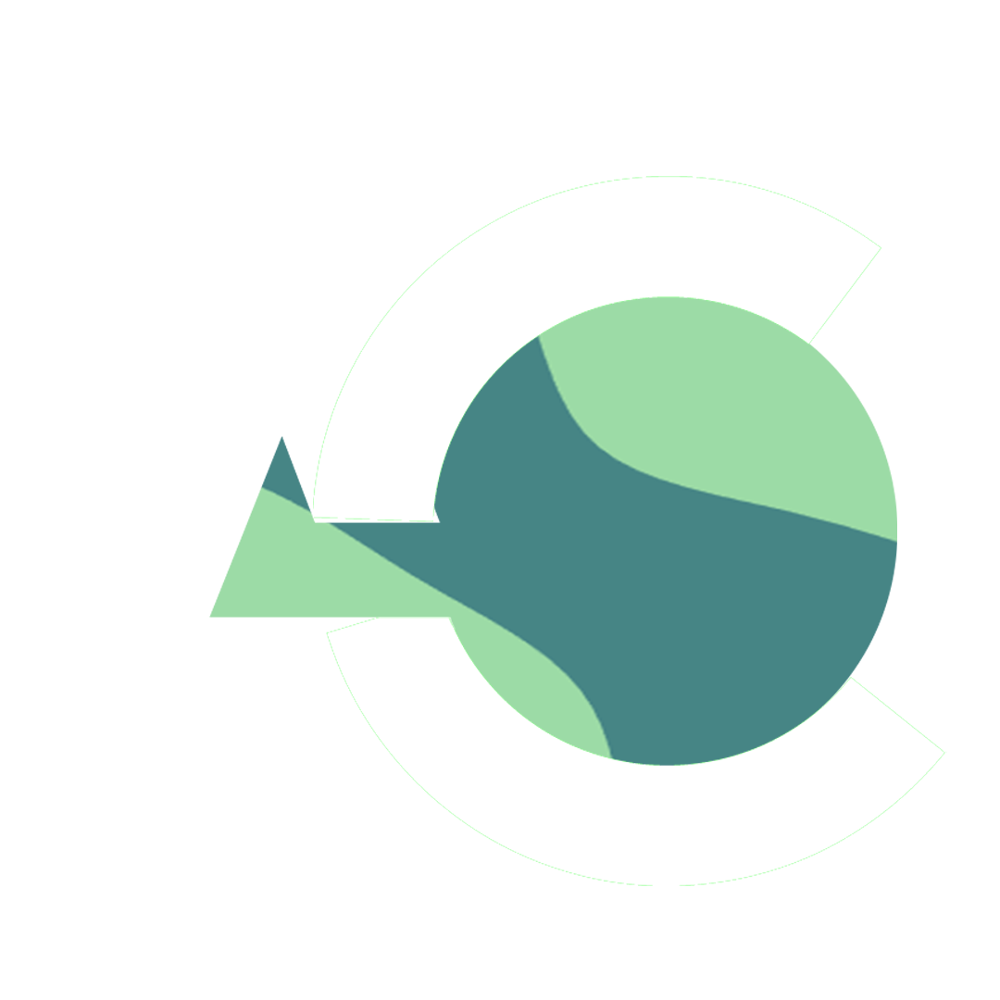

  
  <h1>ACHOVFX</h1>
  <h3>FullStack-Devs⚙️</h3>

<h3>My Expertise 💪</h3>
<h4>Front-End 🎨</h4>

<h4>Back-End 🧑‍💻</h4>

<!--
**achovfx/achovfx** is a ✨ _special_ ✨ repository because its `README.md` (this file) appears on your GitHub profile.

Here are some ideas to get you started:

- 🔭 I’m currently working on ...
- 🌱 I’m currently learning ...
- 👯 I’m looking to collaborate on ...
- 🤔 I’m looking for help with ...
- 💬 Ask me about ...
- 📫 How to reach me: ...
- 😄 Pronouns: ...
- ⚡ Fun fact: ...
-->
